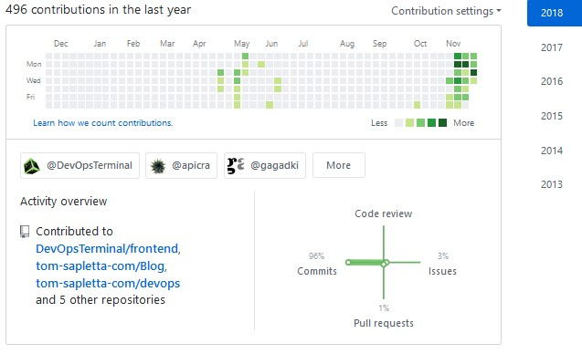

## Idea
W zamysle ma byc to ksiazka o tworzeniu wielu projektow naraz jak tornado w swej mocy, podniesc wszystko na raz
[tutaj analogia sie konczy] nastepnie
by poukladac projekty i zadania w odpowiedni sposob.

Rozwiazania, ktore mam w glowie nie sa na razie sprecyzowane,
mam na mysli pewien sposob funkcjonowania, ktory nie opiera sie na scislych zasadach, ale na flow.

## Flow, jako moc napedowa.
To nie jest rozwiazanie dla kazdego, tylko dla tych, ktorzy maja stany handry i depresji, ktorzy w pewnym momencie nie moga nic zrobic, ale gdy przychodzi flow
sa w stanie realizowac wiele projektow na raz.
To czego brakuje we flow, to wiekszej kontroli, planowania.

Tutaj konieczne by bylo znalezienie odpowiednich bodzcow.

## Realizacja zadan w stanie flow
Zadania do projektow warto spisywac by ich nie zapomniec a nie by przyporzadkowac im konkretne okienko w kalendarzu.
Zamiast spisywac wszystkie zadania do kalendarza wystarczy zwykly notes.

Generalnie zasada jest taka by duzo pisac i to otwarcie, jak najblizej prawdy, aby w ten sposob jak najprecyzyjniej oddac stan obecny, czy tez oczekiwany stan.

## Praktyczny przyklad z zycia
ABy udowdnic, ze to dziala, tworze od prawie 3 tygodni materialy i kod do moich projektow na github.
Mozna to latwo sprawdzic na profilu uzytkownika:

https://github.com/tom-sapletta-com

Jak widac, przed 3 tygodniami kilka razy w roku cos zmienialem, jednak postanowilem to zmienic.

## Cel: codzienna systematyczna praca
Celem nie jest ukonczenie projektu, ale pracowanie nad nim.
Byc moze to dziwne, bo teoretycznie kazdy projekt powinien miec poczatek i koniec.

## Co to jest Projekt
Projekt rozumiem jako zdefiniowany rezultat celu jaki chce osiagnac.
Wiec rezultatu celu np projektu DevOpsTermninal, jest dostarczenie rozwiazania terminalu dla devops.
Terminal taki jest okreslonym celem, ale projekt nie konczy sie na jego zdefiniowaniu ani dostarczeniu rozwiazania, 
projekt taki to proces, wiec sam w sobie jak proces moze byc nieustanny, niekonczacy sie.

W dalszych krokach wyjasnien bede uzywal sformulowania bardziej preczyzyjnego:
+ rezultat celu

## Poczatek
Dlatego, ze tak definiuje projekt: rezultat celu, nie stawiam kropki, po prostu realizuje kolejne etapy, zmiany, naprawy kodu.

### Jak zaczac
Aby zrealizowac cel, trzeba go zdefiniowac, ale zrealizowac go mozna na wiele sposobow, tworzac rownolegle wiele projektow, ktore w sumie dadza efekt.

W tym rozumieniu mozna np. zaczac rownolegle frontend i backend w 2 wersjach:

1. Wersja aplikacji
+ Frontend: Jquery UI
+ Backend: PHP

2. Wersja aplikacji
+ Frontend: Bootstrap
+ Backend: nodejs

W przypadku zrealizowania jednej z wersji aplikacji osiagamy okreslony cel.

### Pytania
Oczywiscie nasowaja sie pytania:
+ po co zaczynac 2 aplikacje w ramach tego samego celu projektu jednoczesnie?
+ po co tracic czas na planowanie dwoch wersji tego samego?

Odpowiedz wynika z samej natury flow.
Jesli jestes w stanie flow, nie potrzebujesz realizowac wg planu na papierze, po prostu robisz go do momentu az zabraknie Tobie czasu.
Gdy masz ped do robienia czegos, zrobisz to znacznie szybciej niz gdy musisz o wszystko pytac innych i uczyc sie komunikacji na kazdym etapie.
Komunikacjato spora czesc w projekcie.

### Pytania
Wiec rodza sie kolejne pytania, skoro mamy zrezygnowac w zespole z komunikacji, to na pewno rezultaty celu beda inne od oczekiwanych.
Tak, masz racje, beda inne o ile nie  zostana wczesniej zdefiniowane jako male czesci wiekszej calosci, a do tego nie potrzeba dlugich rozmow, gdyz to wynika z oczekiwan klienta i musi byc techniczne zgodne z tym co obecnie istnieje.

## Testy jednostkowe na papierze
Dodatkowo, sam rezultat celu jaki chcemy komus zlecic do wykonania, powinien byc bardzo ograniczony, nie powinnismy delegowac czegos czego nie mozemy w krotkiej charkterystyce opisac i zdefiniowac zasady sprawdzania czy takie przyszle rozwiazanie wykonane przez kogos bedzie spelnialo zalozenia.

Wiec zamiast charakterystyki w postaci stwierdzen, powinno zawierac zdania pytajace, majce na celu odpowiedziec TAK/NIE
CZyli takie testy jednostkowe.

